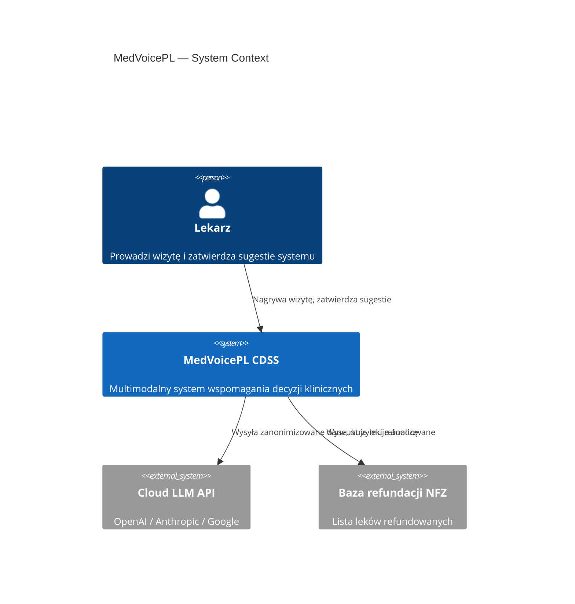

# Architecture

## System Context

```mermaid
C4Context
    title MedVoicePL — System Context

    Person(doctor, "Lekarz", "Prowadzi wizytę i zatwierdza sugestie systemu")

    System(medvoice, "MedVoicePL CDSS", "Multimodalny system wspomagania decyzji klinicznych")

    System_Ext(llm_api, "Cloud LLM API", "OpenAI / Anthropic / Google")
    System_Ext(nfz_db, "Baza refundacji NFZ", "Lista leków refundowanych")

    Rel(doctor, medvoice, "Nagrywa wizytę, zatwierdza sugestie")
    Rel(medvoice, llm_api, "Wysyła zanonimizowane dane, otrzymuje analizę")
    Rel(medvoice, nfz_db, "Wyszukuje leki refundowane")
```

## Data Flow with Trust Boundary

```mermaid
flowchart LR
    subgraph ON_PREMISE["On-Premise (Trust Boundary: INTERNAL)"]
        A[Audio Input] --> B[Whisper STT]
        B --> C[Diarization]
        C --> D[SLM Structuring]
        D --> E[Entity Extraction]
        E --> F[Presidio Anonymization]
        F --> G[Trust Gate]
    end

    subgraph CLOUD["Cloud (Trust Boundary: EXTERNAL)"]
        H[LLM Analysis] --> I[RAG Retrieval]
        I --> J[NFZ Drug Matching]
        J --> K[Drug Suggestions]
    end

    G -->|AnonymizedPayload| H
    K --> L[Doctor Dashboard]
    L --> M[Approval / Rejection]
```

See `diagrams/` for individual Mermaid source files.
